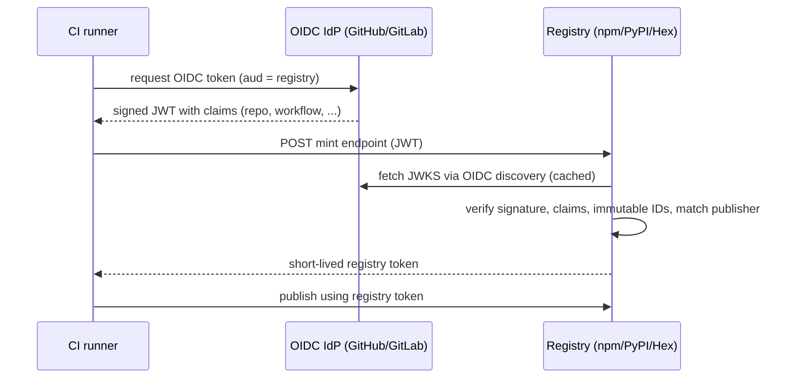

# Trusted Publishers: npm vs PyPI (and what it means for Hex)

Research document for [hexpm/hexpm#1193](https://github.com/hexpm/hexpm/issues/1193).
Compares how npm and PyPI implement "Trusted Publishers" so the Hex
implementation can lean on the established conventions instead of inventing its
own.

Sources:

- npm: <https://docs.npmjs.com/trusted-publishers>
- PyPI internals: <https://docs.pypi.org/trusted-publishers/internals/>
- PyPI adding a publisher: <https://docs.pypi.org/trusted-publishers/adding-a-publisher/>
- PyPI pending publishers: <https://docs.pypi.org/trusted-publishers/creating-a-project-through-oidc/>
- OpenSSF spec: <https://repos.openssf.org/trusted-publishers-for-all-package-repositories.html>

---

## 1. The shared idea

Both registries implement the same OpenSSF-standardized pattern: instead of a
long-lived write token stored in CI secrets, the CI job presents a short-lived,
cryptographically signed **OIDC token** issued by its platform (GitHub Actions,
GitLab CI, etc.). The registry verifies that token against a **trusted publisher**
that a maintainer configured for the package, then mints a **short-lived registry
token** that is used to publish.

The key phrase both use is a **two-phase token exchange**:

1. Client sends the OIDC JWT to the registry; registry verifies it and returns a
   short-lived registry API token.
2. Client uses that registry token with the normal publish endpoint.

PyPI's [internals doc](https://docs.pypi.org/trusted-publishers/internals/)
explains *why* the two-phase exchange is worth the extra round-trip, and the
reasoning applies directly to Hex:

- **Isolation of concerns.** OIDC tokens have external failure modes (the IdP
  fails to sign correctly, discovery is down). Keeping them out of the core
  authN/authZ path stops those concerns from leaking into the registry's own
  logic.
- **Reuse of existing auth code.** The registry mints a token in its own
  existing format, so the large, well-tested body of publish/authorization code
  does not need a parallel "OIDC-aware" path.
- **Secret scanning.** Registry tokens have a recognizable prefix so GitHub
  secret scanning can auto-revoke leaked ones. Raw OIDC JWTs have no such prefix
  and are hard to scan.

---

## 2. Side-by-side comparison

### 2.1 Providers and token model

| Dimension | npm | PyPI |
| --- | --- | --- |
| Supported IdPs | GitHub Actions, GitLab CI/CD, CircleCI (cloud only) | GitHub Actions, GitLab CI/CD, Google Cloud, ActiveState |
| Self-hosted runners | Not supported (planned) | Not supported |
| Exchange model | Two-phase (OIDC -> short-lived npm token) | Two-phase (OIDC -> short-lived PyPI token) |
| Minted token lifetime | Short-lived (not numerically documented) | 15 minutes |
| `aud` value | `npm:registry.npmjs.org` | `pypi` |
| CLI requirement | npm >= 11.5.1, Node >= 22.14.0; auto-detects OIDC env | Handled by upload tooling (e.g. `gh-action-pypi-publish`) |

### Endpoint / wire protocol

There is no RFC or cross-ecosystem wire standard. RFC 8693 (OAuth 2.0 Token
Exchange) is the closest generic mechanism but no registry adopted it here; each
ships a custom endpoint. PEP 807 is an in-progress attempt to standardize the
shape within Python.

| | npm | PyPI |
| --- | --- | --- |
| Mint endpoint | `POST /-/npm/v1/oidc/token/exchange/package/{pkg}` | `POST /_/oidc/mint-token` |
| JWT transport | `Authorization: Bearer <jwt>`, no body (npm notes this differs from the rest of its API) | JSON body `{"token": "<jwt>"}` |
| Response | `{"token": "..."}` | `{"token": "..."}` |
| Audience discovery | none documented | `GET {index}/_/oidc/audience` -> `pypi` |
| Standardization | none | PEP 807 (proposed): `{upload_base}/_/oidc/mint-token` + discovery |

### 2.2 GitHub Actions configuration fields

Both require the same core identity and treat environment as optional. npm
constrains the workflow to a filename; PyPI does the same.

| Field | npm | PyPI |
| --- | --- | --- |
| Owner / org | Required | Required |
| Repository | Required | Required |
| Workflow | Required, **filename only** (e.g. `publish.yml`), must be in `.github/workflows/` | Required, filename (e.g. `release.yml`) |
| Environment | Optional | Optional, **strongly recommended** (enables manual-approval gate) |
| Allowed actions | Required: `npm publish` and/or `npm stage publish` | n/a |

### 2.3 Package <-> publisher cardinality

| | npm | PyPI |
| --- | --- | --- |
| Model | **One** trusted publisher per package at a time (editable) | **Many-to-many** |
| Rationale | Simplicity | One publisher -> many projects (monorepos, tandem releases); one project -> many publishers (per-OS/arch binary wheels) |

PyPI's many-to-many exists because a monorepo can back several projects with one
`release.yml`, and a single project can be published by several per-platform
builders (`release-linux.yml`, `release-macos.yml`). npm chose the simpler
one-per-package model and lets you edit it.

Hex follows PyPI and supports both directions. Publisher configurations are
per-package rows with uniqueness scoped to the package, so the same repository +
workflow can be attached to any number of packages (the RabbitMQ-style monorepo
case), and a package can hold several publisher configurations. A monorepo
workflow run mints once per package, with a fresh OIDC token for each mint,
since a minted OIDC `jti` cannot be reused.

### 2.4 Anti-resurrection (the critical security detail)

Usernames and repo names can be renamed and reclaimed. If a config only matched
`repository_owner: octo-org`, a malicious actor who later grabs the freed
`octo-org` name could publish. This is an **account resurrection attack**.

| | npm | PyPI |
| --- | --- | --- |
| Mitigation | Relies on exact string match of configured fields (docs emphasize case-sensitive exact match; no documented immutable-ID resolution) | Resolves GitHub `repository_owner_id` (immutable numeric ID) **at config time**, stores it, and checks it **at mint time** |
| Config-time verification | **None** - npm does not verify the config when saved; mistakes only surface at publish | Yes - resolving the owner ID requires a lookup, so bad owners are caught early |

PyPI's approach is the stronger one and is what the OpenSSF spec calls for
("reusable or mutable claims must be backed by an immutable and guaranteed
unique identifier"). Hex should follow PyPI here.

### 2.5 Bootstrapping a brand-new package from CI

| | npm | PyPI |
| --- | --- | --- |
| Pending publishers | Not documented (package must already exist) | Yes - configure a "pending" publisher under your account; first successful publish creates the project. Name is not reserved until first publish; if someone else registers it first, the pending publisher is invalidated |

### 2.6 Provenance / attestations

| | npm | PyPI |
| --- | --- | --- |
| Automatic provenance | Yes, by default when publishing via OIDC from GitHub/GitLab, for **public** repo + **public** package (not CircleCI, not private repos) | Digital attestations (PEP 740) with Sigstore |
| Opt out | `NPM_CONFIG_PROVENANCE=false`, `.npmrc`, or `publishConfig.provenance` | n/a |

Hex defers full provenance/attestations, but stores an allowlisted snapshot of the verified OIDC claims at mint time and attaches it to the published release, so the API and UI can show that a release came from trusted publishing and which workflow produced it.

### 2.7 Hardening around tokens

| | npm | PyPI |
| --- | --- | --- |
| Disallow long-lived tokens | Package setting: "Require 2FA and disallow tokens" (does not affect OIDC) | Recommends removing manual tokens after switching |
| Staged publishing | Yes - `npm stage publish` can require a maintainer to approve with 2FA before the release goes public | No direct equivalent |
| Read-only deps token | Recommended for installing private deps (OIDC only covers publish) | Similar guidance |

---

## 3. Points of agreement (safe to adopt directly)

1. Two-phase exchange: verify OIDC, mint a short-lived registry token, publish
   with it. Do not treat the raw JWT as a registry credential.
2. Per-provider, typed configuration. Neither registry uses a generic claim bag;
   each provider has its own required fields.
3. GitHub identity = owner + repository + workflow filename, with environment
   optional. Workflow is a filename, not a path.
4. Short-lived minted tokens (PyPI: 15 min) scoped to the matching package(s).
5. Stable, documented `aud` value bound at verification time.
6. Reject anything that would let an untrusted workflow match (exact,
   case-sensitive matching of the configured fields).

## 4. Where they differ (Hex has to choose)

| Decision | npm | PyPI | Hex plan |
| --- | --- | --- | --- |
| Cardinality | One per package | Many-to-many | `package has_many :trusted_publishers` (covers monorepo + per-platform without a join table) |
| Immutable ID | Exact string match only | Resolve + store `repository_owner_id` | Follow PyPI: resolve at config time, check at mint time |
| Config-time verification | None | Yes (implied by ID resolution) | Follow PyPI: resolve immutable IDs when the publisher is created |
| Pending publishers | No | Yes | Defer to a later phase |
| Provenance | Auto | Attestations | Defer (design schema to allow it later) |
| Mint endpoint | OIDC token exchange endpoint | `/_/oidc/mint-token` | Dedicated `POST /api/oidc/mint-token` |
| `aud` | `npm:registry.npmjs.org` | `pypi` | `hexpm` (documented constant) |

## 5. Implications for the Hex implementation

Grounded in the current codebase:

- **Verify-and-mint, dedicated endpoint.** A new `POST /api/oidc/mint-token`
  returns a normal Hex OAuth access token, so the existing publish path
  (`[lib/hexpm_web/controllers/api/release_controller.ex](lib/hexpm_web/controllers/api/release_controller.ex)`
  -> `authorize` plug -> `[lib/hexpm/permissions.ex](lib/hexpm/permissions.ex)`)
  keeps working, since it already understands `package:{repo}/{name}` scopes.
- **Reuse token infra.** Mint through
  `[lib/hexpm/oauth/tokens.ex](lib/hexpm/oauth/tokens.ex)` with a short
  expiry, mirroring PyPI's 15-minute window and the isolation rationale above.
- **Typed per-provider schema (Option B).** A single `trusted_publishers` table
  with a `provider` discriminator and a `Provider` behaviour, echoing the
  existing `[lib/hexpm/accounts/user_provider.ex](lib/hexpm/accounts/user_provider.ex)`
  discriminator pattern and the per-grant handlers in
  `[lib/hexpm_web/controllers/api/oauth_controller.ex](lib/hexpm_web/controllers/api/oauth_controller.ex)`.
- **Anti-resurrection like PyPI.** Store the entered `repository_owner`, resolve
  it to `repository_owner_id` at config time, and compare the token's
  `repository_owner_id` at mint time.
- **No new dependencies.** `oidcc ~> 3.7` and `joken ~> 2.6` are already in
  `[mix.exs](mix.exs)`, covering OIDC discovery/JWKS and JWT verification.
- **Deferred, matching both registries' newer features:** provenance/attestations,
  staged publishing, "disallow tokens", pending publishers, additional providers
  (GitLab/CircleCI), and any web UI.
